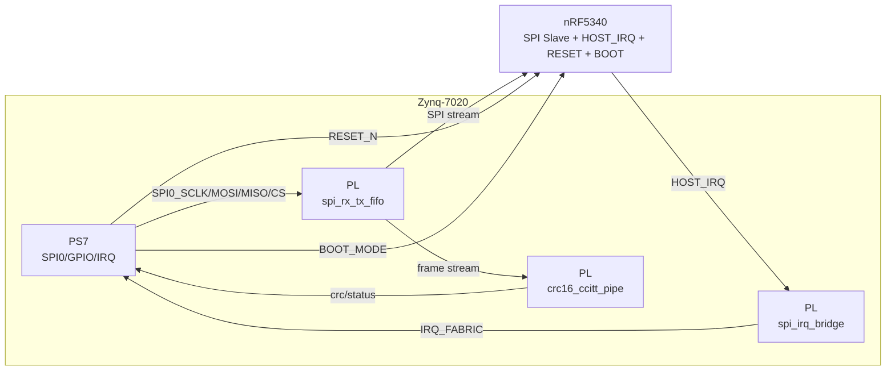

# Zynq-7020 PS/PL 与 nRF5340 连线说明

本文档给出最小可落地连接方式：PS 侧作为 SPI Master，nRF5340 作为 SPI Slave，通过 `HOST_IRQ/RESET/BOOT` 辅助信号完成握手、复位与启动模式控制。

## 1. 连接关系（Mermaid）

## 2. 推荐信号定义

- SPI：`SCLK/MOSI/MISO/CSn` 由 PS SPI0 直连 nRF5340。
- `HOST_IRQ`：建议 **nRF 输出低有效脉冲**，进入 PL 的 `spi_irq_bridge` 做同步与脉宽拉伸后再进 PS IRQ。
- `RESET_N`：PS GPIO 输出，低有效复位 nRF。
- `BOOT`：PS GPIO 输出，用于选择正常启动/DFU 引导路径。

## 3. 时钟、复位与中断极性建议

- SPI 时钟初始建议：8~12MHz，板级稳定后再提升到 20MHz。
- `spi_irq_bridge` 时钟建议接 `FCLK_CLK0`（例如 100MHz）。
- PL 逻辑复位建议低有效 `rst_n`，由 `FCLK_RESET0_N` 或经复位控制器输出。
- 中断极性：
  - nRF 侧：`HOST_IRQ` 低有效（便于线与/上拉容错）。
  - PS 侧：接收拉伸后的高有效 IRQ（在 DTS 中可配置 edge-rising）。

## 4. Vivado 集成要点

1. PS7 使能 SPI0 与 EMIO GPIO（或 MIO，视板卡资源）。
2. 将 `spi_irq_bridge` 接入 IRQ_F2P。
3. 预留状态接口扩展点：`irq_pending`、`pulse_active` 可后续挂 AXI-Lite。
4. 新增模块 `spi_rx_tx_fifo` 与 `crc16_ccitt_pipe` 的寄存器映射与联调建议见 `pl_modules_fifo_crc.md`。
5. Linux 设备树中将 SPI 从设备 compatible 设为 `viriz,nrf5340-proxy-zynq`。
